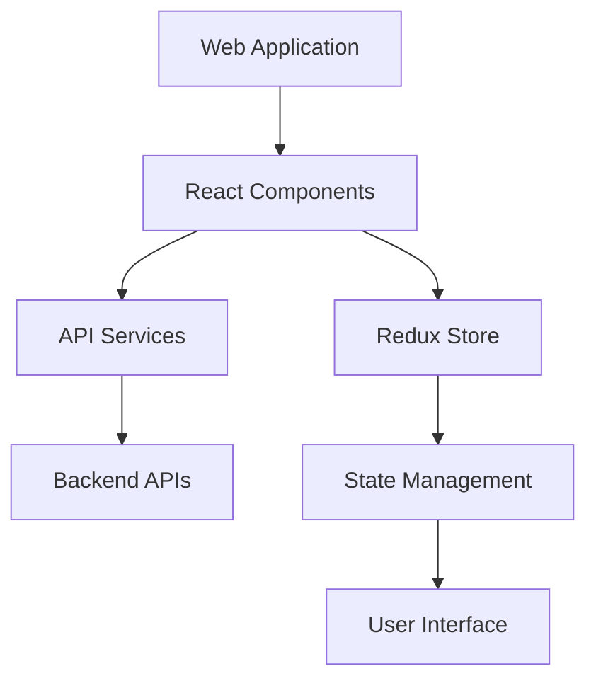
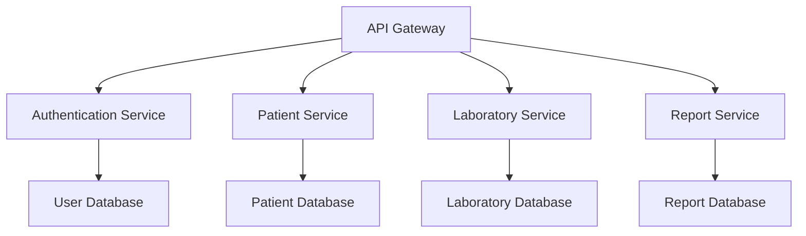
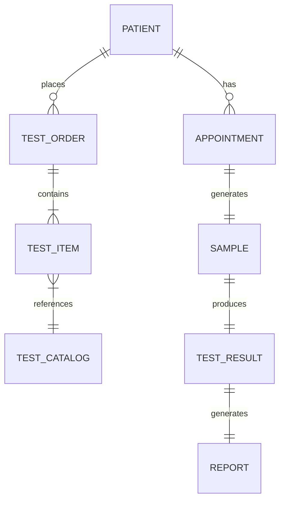
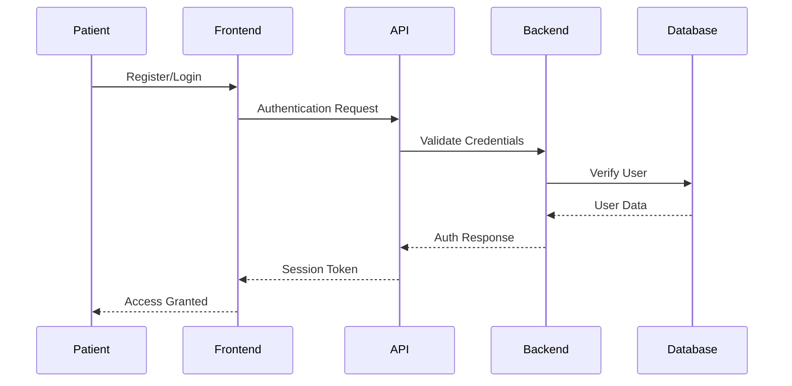
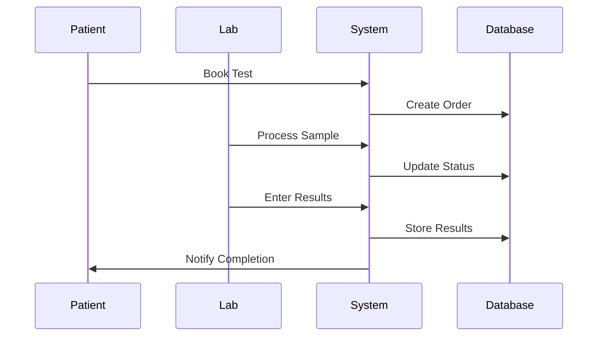
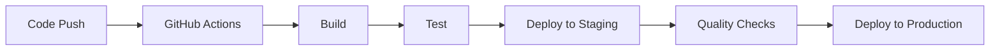

# Pathology Lab Management System

## Table of Contents
- [Project Overview](#project-overview)
- [Project Flow](#project-flow)
- [Core Features](#core-features)
- [System Architecture](#system-architecture)
- [Database Design](#database-design)
- [Data Flow](#data-flow)
- [Flow Diagrams](#flow-diagrams)
- [Deployment Strategy](#deployment-strategy)
- [Tech Stack](#tech-stack)
- [Security Measures](#security-measures)
- [Future Enhancements](#future-enhancements)

## Project Overview

### Purpose
The Pathology Lab Management System is a comprehensive digital solution designed to streamline and automate pathology laboratory operations. It bridges the gap between patients, healthcare providers, and lab technicians by providing a unified platform for test management, result reporting, and administrative tasks.

### Goals
- Automate manual laboratory processes
- Reduce turnaround time for test results
- Minimize human errors in result reporting
- Improve patient experience through digital access
- Enhance data management and security
- Facilitate better inventory management
- Enable real-time tracking of sample status

### Target Users
1. **Patients**
   - Individuals requiring pathology tests
   - Healthcare providers referring patients
   - Insurance companies

2. **Laboratory Staff**
   - Lab technicians
   - Pathologists
   - Sample collectors

3. **Administrative Staff**
   - Front desk operators
   - Billing department
   - Management team

## Project Flow

### Patient Journey
1. **Registration & Appointment**
   - Online/offline registration
   - Appointment scheduling
   - Test selection
   - Cost estimation

2. **Sample Collection**
   - Home collection booking
   - Lab visit scheduling
   - Digital consent forms
   - Sample tracking initiation

3. **Result Access**
   - Digital report delivery
   - Secure result viewing
   - Historical report access
   - Report sharing options

### Staff Workflow
1. **Sample Processing**
   - Sample reception
   - Barcode generation
   - Processing assignment
   - Quality checks

2. **Result Management**
   - Test processing
   - Result entry
   - Verification process
   - Report generation

3. **Administrative Tasks**
   - Inventory management
   - Staff scheduling
   - Quality control
   - Financial reporting

## Core Features

### Patient Portal
- User registration and profile management
- Appointment scheduling
- Test catalog browsing
- Online payment processing
- Digital report access
- Historical data viewing
- Notification system

### Laboratory Management
- Sample tracking system
- Test processing workflow
- Quality control measures
- Inventory management
- Staff scheduling
- Equipment maintenance tracking

### Administrative Dashboard
- User management
- Financial reporting
- Analytics and insights
- Audit trail
- Configuration management
- Document management

### Reporting System
- Customizable report templates
- Automated report generation
- Digital signature integration
- Multiple format support (PDF, HTML)
- Bulk report processing

## System Architecture

### Frontend Architecture

### Backend Architecture

## Database Design

### Key Tables and Relationships

### Core Tables
1. **Patients**
   - PatientID (PK)
   - PersonalInfo
   - MedicalHistory
   - ContactDetails

2. **TestOrders**
   - OrderID (PK)
   - PatientID (FK)
   - TestDetails
   - Status
   - Timestamps

3. **Samples**
   - SampleID (PK)
   - OrderID (FK)
   - CollectionDetails
   - Status
   - HandlingInstructions

## Data Flow

### User Interaction Flow

### Test Processing Flow

## Deployment Strategy

### Infrastructure
- **Frontend Hosting**: Vercel/Netlify
- **Backend Hosting**: AWS EC2
- **Database**: AWS RDS
- **File Storage**: AWS S3
- **CDN**: CloudFront

### CI/CD Pipeline

### Environment Setup
1. **Development**
   - Local development setup
   - Development database
   - Mock services

2. **Staging**
   - Integration testing
   - Performance testing
   - User acceptance testing

3. **Production**
   - High availability setup
   - Load balancing
   - Automated backups
   - Monitoring

## Tech Stack

### Frontend
- **Framework**: React with TypeScript
- **State Management**: Redux
- **UI Components**: Material-UI
- **API Client**: Axios
- **Charts**: Chart.js
- **Testing**: Jest, React Testing Library

### Backend
- **Framework**: Spring Boot
- **API**: REST
- **Security**: Spring Security
- **Database**: PostgreSQL
- **ORM**: Hibernate
- **Testing**: JUnit, Mockito

### DevOps
- **Version Control**: Git
- **CI/CD**: GitHub Actions
- **Containerization**: Docker
- **Container Orchestration**: Kubernetes
- **Monitoring**: Prometheus & Grafana
- **Logging**: ELK Stack

## Security Measures

### Authentication & Authorization
- JWT-based authentication
- Role-based access control
- Multi-factor authentication
- Session management
- Password policies

### Data Security
- End-to-end encryption
- Data encryption at rest
- HIPAA compliance
- Regular security audits
- Automated vulnerability scanning

## Future Enhancements

### Planned Features
1. **AI Integration**
   - Automated result analysis
   - Anomaly detection
   - Predictive analytics

2. **Mobile Applications**
   - Native iOS app
   - Native Android app
   - Cross-platform support

3. **Integration Capabilities**
   - Hospital management systems
   - Insurance providers
   - Government health portals
   - Medical equipment integration

4. **Advanced Analytics**
   - Business intelligence dashboard
   - Predictive maintenance
   - Resource optimization
   - Patient trend analysis

---

> Note: This documentation is continuously updated as the project evolves. For the latest updates, please check the repository regularly.